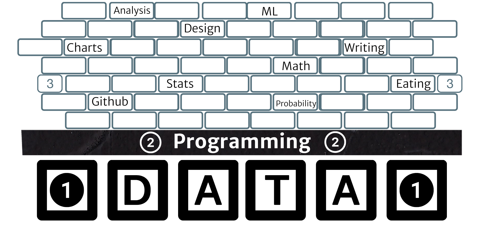

# Git and Github for Data Science

> Data Scientist (n.): Person who is better at statistics than any software engineer and better at software engineering than any statistician. [Josh Wills](https://twitter.com/josh_wills/status/198093512149958656?s=20)

The Darkside of that quote is real!  Data scientists don't program as well as software engineers.  Data scientists are also reasonably soft when it comes to understanding the larger field of statistical analysis. We can improve over time. However, our domain structure often demands that we don't specialize in the technical areas as we often scale up in other domains. If we did specialize, then we would be called statisticians or software engineers.

## My school/professional journey

- 1998: Start my undergraduate at BYU
- 2000: Transfer to the University of Utah
- 2003: Undergraduate in Economics (er [Socialist History](https://dailyutahchronicle.com/2018/04/16/us-economics-department-marxist-or-diverse/)) from the U.
- 2003-2005: Master’s degree in Statistics from BYU.
- 2005-2012: [Statistician: Pacific Northwest National Laboratory (PNNL)](https://www.pnnl.gov/computational-mathematics-statistics-0)
- 2012-2015: Reformed statistician: PNNL
- 2015-Current: [Data Science Professor: BYU-I](https://www.byui.edu/mathematics/student-resources/data-science)
- 2015-Current: Owner and Data Scientist of Data-Driven Consulting (Medical records and Child Health Analytics, Environmental Sampling, Business Consulting)

## How do we demonstrate our data savviness and programming experience?

__Github!__

> It is no exaggeration to say that git (and other forms of version control software) underlie the entire world of open-source software, and are central to the operation of nearly every tech company on the planet. ... OK, now the bad news: learning git kinda sucks. I mean, it’s not painful like performing an appendectomy on yourself without anesthesia, and it’s not hard like quantum mechanics or geometric topology; it’s definitely something anyone can learn. [ref](https://www.practicaldatascience.org/html/git_and_github.html)

### Git

- [Download Git](https://git-scm.com/)
- [Getting the git workflow](https://rogerdudler.github.io/git-guide/)

### Github

__GitHub is key to your employment as a Data Scientist.__

- [Join Github](https://github.com/join)

> This is GitHub, the world’s largest code repository platform online. A platform used by some 50 million software developers to host their coding projects, most of them open-source — meaning others can access their codes and modify them to create better versions if they feel like.

> Most of the internet is produced or hosted on GitHub in the form of code. “What Gmail is to email, GitHub is to writing software,” says Kiran Jonnalagadda, co-founder of HasGeek, a platform to build and discover peer groups.

Read more [here](https://economictimes.indiatimes.com/internet/inside-github-web-developers-social-media-platform/articleshow/77096752.cms?utm_source=contentofinterest&utm_medium=text&utm_campaign=cppst).

### A primary differentiator between an analyst and a data scientist

_It signals that you are a programmer as well as an analyst._

> Github is our version control, and we have everything on Github. Definitely having strong git experience is very helpful. The way my team is using it is through forking. We fork the main file and then pull from and to it to update the code.
>
> Keaton Sant, Data Scientist at John Deere

### Is it going to hurt?

__Yes.__

It feels weird at first but quickly becomes second nature—more bad news. Our pain will be short-lived because students primarily work in their own repositories. Do you use GitHub to work with other people or to coordinate your own work from multiple computers? If so, after you recover from the initial setup, git will crush you again with merge conflicts. And this is not one-time pain; this could be a dull ache for a long time. The best remedy is prevention, but also understanding how to back out of tricky situations and tackle them on your own terms.

Managing a project via Git/GitHub is much more like the Google Doc scenario and enjoys many of the same advantages. It is definitely more complicated than collaborating on a Google Doc, but this puts you in the right mindset. [ref](https://happygitwithr.com/big-picture.html)

### Github and education guidelines

1. __Don't post assignments__
2. __Do post unique code and projects using skills from your classes__
3. __Use private repos with [student education account](ttps://education.github.com/students) to manage your course work__
4. __Use it to communicate__

### Managing your Github space

If you are trying to get a job, then your Github space should be organized. Take the time to make this space your coding ‘social media’ where people see the best side of your work.

- Make your landing page stand out by [Managing your profile README](https://docs.github.com/en/github/setting-up-and-managing-your-github-profile/customizing-your-profile/managing-your-profile-readme). Use [this guide](https://daily.dev/blog/creating-a-killer-github-profile-readme-part-1) for additional inspiration.
- Track your work and share it with the world.
- Organize and document your repositories. Here are some [great examples](https://github.com/matiassingers/awesome-readme)
- Find a project you could support (long-term goal).

### Github's other tools

[Github desires to be the social communication tool for coders](https://docs.github.com/en/get-started/quickstart/communicating-on-github) [reference](https://news.thewindowsclub.com/microsoft-is-making-github-more-like-facebook-but-only-for-developers-101837/). Versioning and sharing code is the core.  However, ignoring the other available tools is not wise. 

- [Github pages](https://pages.github.com/)
- [Project and Organization Wikis](https://docs.github.com/en/communities/documenting-your-project-with-wikis/about-wikis) ([D3 Example](https://github.com/d3/d3/wiki))
- [Issues](https://docs.github.com/en/issues/tracking-your-work-with-issues/about-issues)
- [Discussions](https://docs.github.com/en/discussions)
- [Projects](https://docs.github.com/en/issues/trying-out-the-new-projects-experience/about-projects)
- [Github Actions](https://docs.github.com/en/actions) (I use [the peaceiris action for hugo](https://github.com/peaceiris/actions-hugo) for our [data science programming course at BYUI](https://byuistats.github.io/CSE250-Hathaway/) The R for Data Science book [does as well](https://github.com/hadley/r4ds/actions))

## Your personal data projects workflow

You don't need to make these projects complicated. These projects are built to show your work using the skills you have developed during school. I would make sure that these personal projects are presentable. You want to demonstrate your creativity. You could use the following links to find a new data set. 

- [FiveThirtyEight](https://github.com/fivethirtyeight/data)
- [TidyTuesday](https://github.com/rfordatascience/tidytuesday)
- [WorkoutWednesday](http://www.workout-wednesday.com/)
- [Kaggle](https://www.kaggle.com/datasets)
- [data.world](https://data.world/search?context=community&entryTypeLabel=dataset&q=free+data&type=all)

## Let's go through the prAcess with this [Github repo](https://github.com/hathawayj/gitandgithub)

1. Fork repo on Github
2. Clone repo to local computer
3. Fix the spelling error above and save the file
4. Add a new file called `notes.md`
5. Add or stage your changes
6. Commit your work
7. Push to github
